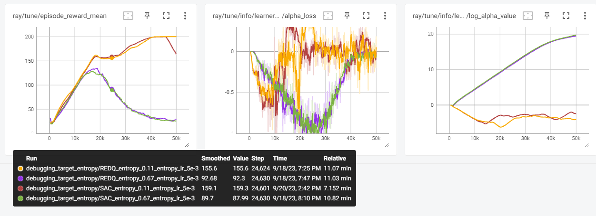
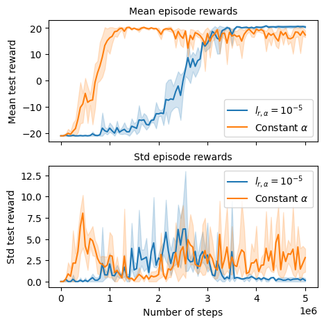
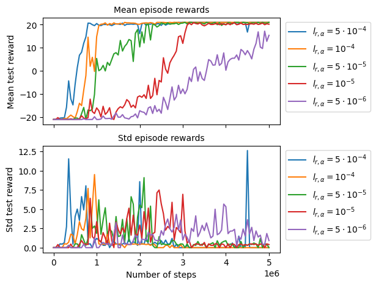
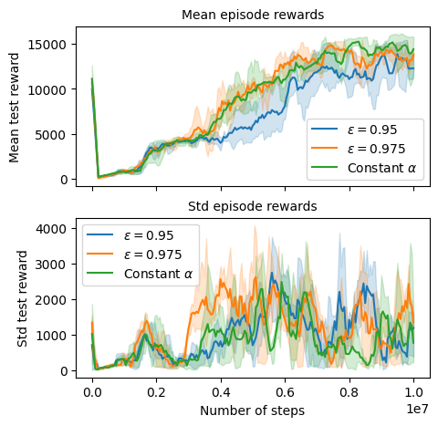
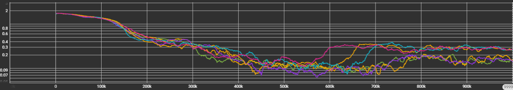

**Caution!** This is not a peer-reviewed conference paper, just a blog post. Therefore take the findings with a pinch of salt 
and verify! 

Further, these notes assume the knowledge of Reinforcement Learning methods specifically the Soft-Actor Critic method by [Haarnoja et al](https://proceedings.mlr.press/v80/haarnoja18b/haarnoja18b.pdf). 

- [A sketch of the Soft-Actor Critic Approach](#a-sketch-of-the-soft-actor-critic-approach)
- [Implementation of automatic entropy tuning](#implementation-of-automatic-entropy-tuning)
- [How to set the target entropy in the discrete SAC?](#how-to-set-the-target-entropy-in-the-discrete-sac)
  - [Standard approach](#standard-approach)
  - [A novel (?) approach](#a-novel--approach)
- [Experiments](#experiments)
  - [Experiments with Ray RLlib Library](#experiments-with-ray-rllib-library)
  - [Experiments with Tianshou Library](#experiments-with-tianshou-library)
- [Takeaways](#takeaways)
- [References](#references)


## A sketch of the Soft-Actor Critic Approach

In the original, seminal paper [Haarnoja et al](https://proceedings.mlr.press/v80/haarnoja18b/haarnoja18b.pdf) proposed the following optimization problem as an off-policy policy gradient approach:

$$
\max_{\pi(\cdot)} ~\mathbb{E}_{(s_t,a_t) \sim \rho_\pi} [r(s_t, a_t)], 
\text{ s.t. } ~\mathbb{E}_{(s_t,a_t) \sim \rho_\pi} \left[ \log(\pi(a_t|s_t)) | \right] \geq H_{\rm target},
$$

where $H_{\rm target}$ is the target entropy of the optimal policy. This problem can be solved using a Lagrangian approach:

$$
\max_{\pi(\cdot)}\min_{\alpha \ge 0} ~\mathbb{E}_{(s_t,a_t) \sim \rho_\pi}[r(s_t, a_t)] + \alpha \mathbb{E}_{(s_t,a_t) \sim \rho_\pi} \left(-\log(\pi(a_t|s_t)) - H_{\rm target} \right).
$$

The algorithm then updates the policy $\pi$, the coefficient $\alpha$ during the learning procedure. However, in some cases, it can be easier just to set a specific value of $\alpha$, if such a value can be guessed.

Solving this max-min problem is not very hard in comparison with the heuristic approach of fixing $\alpha$. Therefore, the parameter $\alpha$ is often tuned automatically. However, we need to pick a reasonable value of the target entropy.
In the case, of Gaussian action distribution centered around zero, the entropy can be computed as 

$$H_{\rm target} = 0.5 * \log(\sigma^2 * 2 * \pi * e),$$ 

which is equal to $-0.88$ for $\sigma=0.1$. This means that the lower bound on the policy entropy should be a Gaussian with a small variance.
Therefore, [Haarnoja et al](https://proceedings.mlr.press/v80/haarnoja18b/haarnoja18b.pdf) suggested setting the target entropy to $-|\cal A|$, where $|\cal A|$ is the dimension of the action space. Assuming that the actions are mutually independent, this validates the entropy calculations above.


## Implementation of automatic entropy tuning
Given the min-max problem above the implementation of entropy tuning is performed by updating $\alpha$ using the gradient descent and differentiating the objective, i.e.:

$$
\alpha := \alpha - l_{r, \alpha} \nabla_{\alpha} (\mathbb{E}_{(s_t,a_t) \sim \rho_\pi} [r(s_t, a_t)] + \alpha \mathbb{E}_{(s_t,a_t) \sim \rho_\pi} \left(-\log(\pi(a_t|s_t)) - H_{\rm target} \right))
$$

where $l_{r,\alpha}$ is the learning rate of the parameter $\alpha$. Taking the gradient we end up with the following update:

$$
\alpha := \alpha + l_{r, \alpha} \mathbb{E}_{(s_t,a_t) \sim \rho_\pi} \left(\log(\pi(a_t|s_t)) + H_{\rm target} \right)
$$

In practice, however, things differ ever so slightly. First, of all to restrict $\alpha$ to be positive one typically optimizes over $\log(\alpha)$ instead. Leading to the following objective:

$$
\mathbb{E}_{(s_t,a_t) \sim \rho_\pi} [r(s_t, a_t)] + \exp(\beta) \mathbb{E}_{(s_t,a_t) \sim \rho_\pi} \left(-\log(\pi(a_t|s_t)) - H_{\rm target} \right)
$$

where $\beta = \log(\alpha)$. However, in practice the gradient update is different! For example, in the paper [Revisiting Discrete Soft Actor Critic](https://arxiv.org/abs/2209.10081) the authors used the following loss in [their implementation](https://github.com/coldsummerday/Revisiting-Discrete-SAC/blob/main/src/libs/discrete_sac.py#L231):

```python
    log_prob = - entropy.detach() + self._target_entropy
    alpha_loss = -(self._log_alpha * log_prob).mean()
```

The same loss is used in [Ray](https://github.com/ray-project/ray/blob/master/rllib/algorithms/sac/sac_torch_policy.py#L319C18-L319C18) and [TorchRL](https://github.com/pytorch/rl/blob/main/torchrl/objectives/sac.py#L761). From the mathematical perspective, it seems correct to implement 
the following loss instead:

```python
    log_prob = - entropy.detach() + self._target_entropy
    alpha_loss = -(torch.exp(self._log_alpha) * log_prob).mean()
```

While the standard loss seems to be mathematically incorrect, it does result in gradients of a correct direction. The only difference is the norm of the gradients, which is especially noticeable for values of $\alpha$ deviating from $1$. So why the standard loss is chosen this way? It is argued that this update was in the original paper and therefore should be used unless there is evidence that "the correct loss" leads to improved performance. I haven't seen such evidence and perhaps this is the reason why this loss is still used. 

## How to set the target entropy in the discrete SAC?
### Standard approach

How do these ideas translate to the discrete case? [Christodoulou](https://arxiv.org/pdf/1910.07207.pdf) derived the discrete version of the algorithm and proposed to 
set the target entropy as follows:

```python
    target_entropy = - 0.98 * np.log(1.0 / action_space.n)
```

However, what does it mean for a policy with two actions? The target entropy is now $0.67$, while the entropy for a uniform distribution (with a probability $p=0.5$ for both actions) is equal to $0.69$! 

This means that the target entropy of the policy should be (almost) equal to *the entropy of the random policy*. This does not feel right...


### A novel (?) approach 

In the discrete action case, the classical approach uses an epsilon-greedy approach that picks an action according to the rule

$$
    a = 
    \begin{cases}
        \pi(s)  & \epsilon, \\
        \text{random} & 1-\epsilon,
    \end{cases}
$$

where $\pi(s)$ is the greedy (deterministic) policy, which is chosen with probability $\varepsilon$. While the uniformly random policy is chosen with probability $1-\varepsilon$. Computing the entropy of this policy can be hard, but we can approximate it using the following expression:

```python
    epsilon = 0.95
    # log probability of the greedy action                
    target_entropy = - epsilon * np.log(epsilon)                  
                   # log probability of random actions
                   +(1-epsilon) * np.log((1-epsilon)/(action_space.n-1))
```

Here, we assume that the greedy action is taken with probability $\varepsilon$, while the rest of the actions are uniform random and chosen with probability $1-\varepsilon$. Therefore, we can ensure that our stochastic policy is at least as stochastic as an epsilon-greedy policy. 

For a two-action policy, the target entropy is now equal to $0.19$,
which is closer to zero indicating a more deterministic approach. For $0.99$ the target entropy becomes $0.05$.

## Experiments

While the derivation may seem plausible, the proof is always in the pudding or [rather in eating it](https://en.wiktionary.org/wiki/the_proof_of_the_pudding_is_in_the_eating#:~:text=The%20current%20phrasing%20is%20generally,you%20fry%20the%20eggs%E2%80%9D). Therefore, I conducted some experiments. 

### Experiments with Ray RLlib Library

{: width="100%" height="100%" }{: style="float: left"}  


I first tried Ray Library and its implementation of SAC. The Ray implementation of the algorithm uses only one Q-function for policy updates, but two functions are used in the Q-function estimation. This choice was a bit confusing to me and therefore I implemented a version of [RED-Q](https://openreview.net/pdf?id=AY8zfZm0tDd) to make sure that the target entropy is an issue and not other design choices. RED-Q uses an ensemble of functions to estimate the Q function and update the policy. 

I then experimented with the Cart-Pole environment and the implementations of SAC and RED-Q. I set the target entropy to $0.11$, which corresponds to $\varepsilon=0.95$. 
The results in the figure to the left clearly indicate that setting the target entropy according to the proposed formula is better than the approach initially proposed by [Christodoulou](https://arxiv.org/pdf/1910.07207.pdf). This also may be surprising that the standard formula didn't perform well in such a simple environment. However, considering that the target entropy is close to the entropy of the uniform distribution, it seems that the algorithm struggles to find "good" actions in this simple case.

Experiments on Atari environments were not very successful, however, this is because additional features needed to be implemented. This was the reason to move to [Tianshou](https://github.com/thu-ml/tianshou) library, where these features were implemented.

### Experiments with Tianshou Library

[Tianshou](https://github.com/thu-ml/tianshou) is an RL library from Tencent and recently was used as a base to [revisit](https://github.com/coldsummerday/Revisiting-Discrete-SAC?tab=readme-ov-file) and improve [discrete Soft-actor-critic algorithm](https://arxiv.org/abs/2209.10081). [Zhou et al](https://arxiv.org/abs/2209.10081) made two improvements to the algorithm: penalize entropy and double average Q-learning with Q-function clipping. 

{: width="43%" height="43%" }{: style="float: left"} 
{: width="57%" height="57%" }{: style="float: left"} 

I start with the environment Pong and use the same parameters. I used the standard parameters, three seeds, and chose $\varepsilon = 0.95$, which leads to the target entropy equal to $0.28$. Note that [Zhou et al](https://arxiv.org/abs/2209.10081) used a constant $\alpha$ without automatic entropy tuning. Their results are competitive due to a careful choice of $\alpha$ and the adjustments they made. However, automatic entropy tuning outperforms the tuned version in this case. It is also visible that the variance is lowered with automatic entropy tuning. The learning speed of the return can be adjusted by using different learning rates for the parameter $\alpha$. 
I set it to $10^{-5}$ to allow the algorithm to explore at the beginning of the learning process as $\alpha$ approaches zero fairly fast with $10^{-4}$, for example. 


Naturally, these couple of experiments are not fully representative and the behavior may still not improve significantly. I next chose the QBert environment which turned out to be a more challenging choice. I experimented with a few different values for $\varepsilon$ and the target entropies (see values below). I used also just three seeds for these experiments.

|$\varepsilon$ | target entropy |
|----------|-------------|
| $0.95$ | $0.28$ |
| $0.975$ | $0.16$ |
| $0.99$ | $0.07$ |

The results for the return (mean and variance) are smoothed with a running average of $5$ to make the curve easier to distinguish. In this case, the performance of automatic entropy tuning is not superior to the constant $\alpha$, however, the behavior is often within error intervals. Note also that the variance of the returns is quite large and making more confident conclusions from these experiments is hard. 

{: width="70%" height="70%" }

Plotting the entropy we observe that we generally converge to the target entropy level, which implies that the learning rate for $\alpha$ is chosen appropriately. 

{: width="70%" height="70%" }

## Takeaways

The scope of my experiments is limited to make confident conclusions, but it is clear that the target entropy choice is (at least) appropriate and leads to stable experiments. In simple environments (cartpole, pong), automatic entropy tuning is working quite well delivering stable learning curves and returns.

I didn't seek to answer other questions, but there could be a few more interesting ones. For example, do we need the entropy penalty suggested by [Zhou et al](https://arxiv.org/abs/2209.10081) if entropy is automatically tuned? It does seem though that the fixes by [Zhou et al](https://arxiv.org/abs/2209.10081) are still quite beneficial for Atari games.  

## References

1. Haarnoja T, Zhou A, Hartikainen K, Tucker G, Ha S, Tan J, Kumar V, Zhu H, Gupta A, Abbeel P, Levine S. Soft actor-critic algorithms and applications. arXiv preprint arXiv:1812.05905. 2018 Dec 13.
2. Christodoulou, Petros. “Soft actor-critic for discrete action settings.” arXiv preprint arXiv:1910.07207 (2019).
3. Zhou, Haibin, et al. "Revisiting discrete soft actor-critic." arXiv preprint arXiv:2209.10081 (2022). 
4. Chen, Xinyue, et al. "Randomized ensembled double q-learning: Learning fast without a model." arXiv preprint arXiv:2101.05982 (2021).