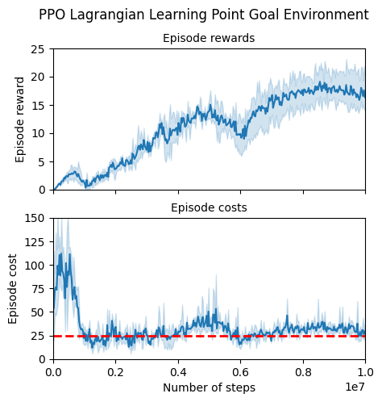

**Caution!** This is not a peer-review conference paper, just a blog post. Therefore take the findings with a pinch of salt 
abd verify! 

## Implementing Lagrangian PPO and PID Lagrangian

the code is found [here](https://github.com/aivarsoo/ray/tree/lagrange-ppo)

### Lagrangian coefficient modelling: why `softplus`?

### Simplifying PID Lagrangian 
#### Polyak update

Polyak update is a low-pass filter, so why do we need a low-pass filter if integrate?

<!-- ### Possible additional features

#### Anti-windup 

#### Low-pass / High-pass filters instead of I and D parts -->

### Tuning the algorithm

The end result of tuning with
$$l_r = 10^{-4}$$,
$$l_{r, penalty} = 5 \cdot 10^{-3}$$
{: width="50%" height="50%" }
{: style="float: left"}