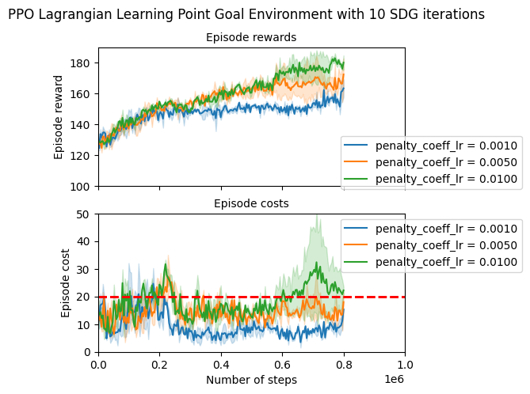
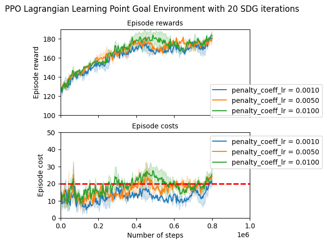
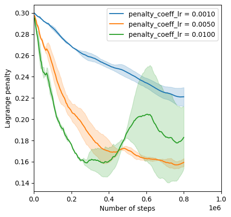

**Caution!** This is not a peer-reviewed paper, just a blog post. Therefore take the findings with a pinch of salt 
and verify! 

Further, these notes assume the knowledge of Safe Reinforcement Learning methods and specifically the PPO Lagrangian method developed by [Ray et al](https://cdn.openai.com/safexp-short.pdf). 


## Implementing Lagrangian PPO and PID Lagrangian
- [Implementing Lagrangian PPO and PID Lagrangian](#implementing-lagrangian-ppo-and-pid-lagrangian)
- [Main idea](#main-idea)
- [Lagrangian penalty modeling](#lagrangian-penalty-modeling)
- [PID Lagrangian](#pid-lagrangian)
- [Experimental Results](#experimental-results)
  - [Tuning the Algorithm](#tuning-the-algorithm)
  - [Safety Point Goal](#safety-point-goal)

[The repo can be found here](https://github.com/aivarsoo/ray/tree/lagrange-ppo)

## Main idea

The Safe Reinforcement Learning problem is typically formulated as follows:

$$
\begin{aligned}
\max_{\pi_{\theta}}~~&J_r(\theta)\triangleq\mathbb E_{\tau \sim \pi_{\theta}}\left(\sum_{t=0}^T r_t\right), \\
\text{subject to: } &J_c(\theta)\triangleq\mathbb E_{\tau \sim \pi_{\theta}}\left(\sum_{t=0}^T c_t\right) \leq d,
\end{aligned}
$$

where the costs $$c_t$$ and rewards $$r_t$$ are assumed to be read from the environment. The standard approach to solving this problem is considering a Lagrangian formulation, i.e.

$$
\max_{\pi_{\theta}}\min_{\lambda \ge 0} J_r - \lambda (J_c - d)
$$

The new variable $$\lambda$$ is called the Lagrangian penalty is also an optimization variable. The optimization algorithm will now sequentially optimize over $$\pi_{\theta}$$ and $$\lambda$$ using gradient ascent and gradient descent, respectively.

## Lagrangian penalty modeling

In the original Lagrangian PPO implementation the Lagrangian multiplier is modeled using [the softplus function](https://github.com/openai/safety-starter-agents/blob/master/safe_rl/pg/run_agent.py#L146):

```python
    penalty = tf.nn.softplus(penalty_param)
```
where the `penalty_param` is the `tf` variable and `penalty` is the actual multiplier. This leads to the following optimization problem:

$$
\max_{\pi_{\theta}}\min_{\mu} J_r - {\rm softplus}(\mu) (J_c - d)
$$


Recall that softplus is defined as: 

$$
{\rm softplus(x)} = \log(1 + \exp(x)),  
$$

and therefore, we do not need to constrain the penalty term anymore. However, there is another reason for this choice. The derivative of `softplus` is computed as follows:

$$
\nabla {\rm softplus(x)} = \frac{\exp(x)}{1 + \exp(x)}.
$$

Therefore, the gradient is scaled by the factor $$(1+\exp(-x))^{-1}$$, which is close to one for large values of $$x$$, but smaller than one for $$x<1$$. This means that the derivative update is **scaled down** in comparison with treating `penalty` as `tf` variable. Therefore, when the Lagrangian penalty dips below one, the penalty will be updated with smaller increments in comparison with updates with the penalty being larger than one. Naturally, if the penalty is larger than one, then typically the constraint violations are more pronounced.  

I implemented the Lagrangian update manually without automatic differentiation so that I could add PID Lagrangian updates. 

## PID Lagrangian

Recently, it was proposed to treat the penalty term $$\lambda$$ as a control signal in its own right and use a simple, but effective [PID controller](https://portal.research.lu.se/en/publications/advanced-pid-control). [This approach](https://arxiv.org/abs/2007.03964) showed great performance in various tasks including [the safety gym tasks](https://openreview.net/forum?id=GH4q4WmGAsl). 

First, let's have a few words on PID (proportional-integral-derivative) controllers. A typical control problem that many engineers face is making a system's output $$y_k$$ following a certain constant reference value $$r$$, using control signals $$u_k$$. The idea of the PID controller is quite simple: we will use the error term $$e = r - y$$ to determine $$u$$:

$$
u = K_P e + K_I \int e dt  + K_D \dot e.
$$

The first term is called *the proportional controller* with the gain $$K_P$$ and it determines the control signal based on the sign of the current error. To ensure the possibility of the zero error tracking *the integral controller* with the gain $$K_I$$ integrates all previous errors. Finally, the main function of the *the derivative controller* with the gain $$K_D$$ is to predict future errors by measuring its derivative. 

In practice, the integral and the derivative part are implemented using approximations. For instance, the easiest way to implement the integral part is to sum up all the previous errors and the derivative part is to use the difference instead of the derivative.


[Stooke et al](https://arxiv.org/abs/2007.03964) argued that a standard Lagrangian update can be seen as an *integral* controller. Indeed, a penalty update can be written as follows:

$$
\begin{aligned}
e_k &= J_c - d \\
\lambda_{k+1} &= (\lambda_k + K_I e_k)_+,
\end{aligned}
$$

where $$(x)_+ = \max(x, 0)$$ makes sure that the penalty term is non-negative. The goal of this "controller" is keeping the error term $$e_k$$ around zero and thus keeping the cost $$J_c$$ around $$d$$.

Having made this observation, one can reasonably try to implement the P and the D parts as well! The authors propose the following update:

$$
\begin{aligned}
e_k &= J_c - d, \\
I_k & = I_{k-1} + e_k, \\
P_k & = p(e_k, P_{k-1}, \alpha_K), \\
D_k & = p(e_k, D_{k-1}, \alpha_D), \\
\lambda_{k+1} &= (K_P P_k + K_I e_k + K_D(D_k  - D_{k-1}))_+,
\end{aligned}
$$

where $$p(x, x_{p}, \alpha) = \alpha x_{p} + (1-\alpha) x$$ is a Polyak update smoothing the error signal for better estimation of proportional and integral parts.

In our implementation, we largely follow this recipe, however, we update the $$\mu$$ variable, i.e., the penalty modeled through `softplus`.

## Experimental Results
### Tuning the Algorithm
I tuned the algorithm on the environment first developed by [Cowen-Rivers et al](https://arxiv.org/abs/2006.09436) and is implemented [here](https://github.com/aivarsoo/ray/tree/lagrange-ppo). I will refer the reader to the original paper for the description of the environment. I've set the desired cost limit to $$20$$. 

I started tuning the algorithm with a fairly low learning rate $$l_r$$ and a fairly low number of gradient updates per iteration. The idea was to give the penalty optimization more time to adjust for possible mistakes, which I felt was important since the penalty is updated once per iteration. It is probably not the most sample-efficient approach, but it is a good starting point since the experiments can be a bit faster due to the low number of SDG iterations.

First, I fixed the learning rate and experimented with the number of SDG iterations and penalty term learning rate. I used just two seeds here to evaluate how well the parameters behave.

{: width="50%" height="50%" }{: style="float: left"} 
{: width="50%" height="50%" }
{: style="float: right"}

With $$10$$ SDG iterations, it appears that the penalty $$l_r = 10^{-3}$$ is too low and limits the learning of **the rewards** and decreases the accumulated cost well below the expected level of $$20$$. While increasing the learning rate improves the reward learning and increases the expected cost. While it is less obvious a similar phenomenon is happening with $$20$$ SDG iterations. To figure out why this is happening let's have a look at the Lagrangian penalty terms (here I used $$10$$ SDG iterations). 

{: width="50%" height="50%" }{: style="float: center"}

With the penalty learning rate equal $$10^{-3}$$, the penalty term remains large, which is a probable reason for keeping the costs and the rewards down. With an increase to $$5\cdot 10^{-3}$$, the penalty magnitude goes down and stabilizes around the value $$0.16$$ delivering a good trade-off between the constraint satisfaction and the reward learning. With the learning rate $$10^{-2}$$ controlling the penalty magnitude becomes harder, which results in more oscillations in penalty and return learning curves. 


### Safety Point Goal

The end result of tuning with
$$l_r = 10^{-4}$$,
$$l_{r, penalty} = 5 \cdot 10^{-3}$$
{: width="50%" height="50%" }
{: style="float: left"}

The main observation is that in this training regime, the policy first learns how to satisfy the constraints and only then starts learning to maximize the return. If we increase the learning rate without increasing the penalty learning rate, however, the policy will first learn to maximize the reward and then slowly decrease the average cost. 

Tuning the learning rate seems to be a complicated task requiring a trial-and-error approach. Now I am working on adding PID Lagrangian experiments that should make things a bit easier.